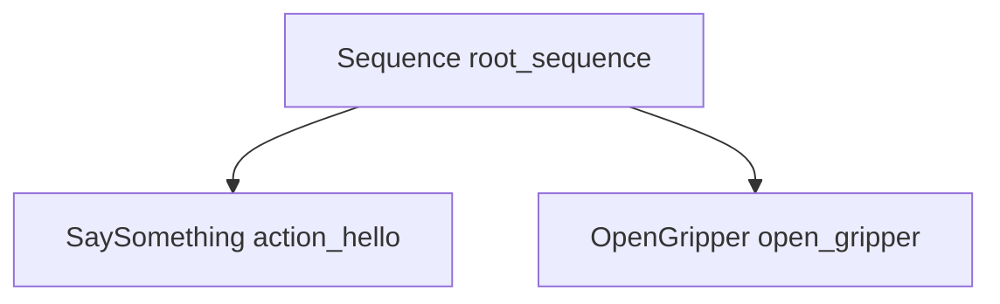

# AI & agent integration path

How Cursor/VS Code agents can **read**, **explain**, **edit**, and eventually **see** behavior trees through BTView — without replacing XML as the source of truth.

Related: [Roadmap](../ROADMAP.md) · [Architecture](../development/ARCHITECTURE.md) · [Groot parity](GROOT_PARITY.md)

## Goals

| Agent capability                       | User benefit                                        |
| -------------------------------------- | --------------------------------------------------- |
| Open BT Graph for a file               | Human sees canvas while agent works on XML          |
| Understand tree structure              | “What does this mission do?” without manual tracing |
| Explain validation / unknown nodes     | Fix mis-typed XML with context                      |
| Propose edits (add Sequence, reparent) | Faster authoring from natural language              |
| Show **snippets** in chat              | Quoted XML or JSON subtree, not whole file          |
| **Screenshot / diagram** in chat       | Visual confirmation of layout (optional)            |
| Monitor-aware reasoning (0.5+)         | “Why did this branch fail on tick 42?”              |

## What agents can do **today** (no BTView changes)

Agents in Cursor already have strong leverage on **files** and **terminals**:

```text
Read fixtures/v4/simple_sequence.xml     → full XML in context
Grep / SemanticSearch in workspace       → find trees, node IDs, includes
Problems panel                           → BTView diagnostics (when extension active)
Run: code/cursor command btview.openPreview  → opens custom editor for user
```

**Structured understanding without the graph:** `src/btcpp/` parser + `SerializedDocument` in `src/shared/protocol.ts` mirror what the webview sees. An agent that reads XML gets the same semantic model the graph uses (kinds, paths, validation).

**Limits today:**

| Want                           | Blocker                                                                        |
| ------------------------------ | ------------------------------------------------------------------------------ |
| Screenshot of BT Graph         | Webview is an isolated iframe; browser MCP does not attach to VS Code webviews |
| “What node is selected?”       | No exported command/API                                                        |
| “Apply this reparent” reliably | Agent must edit XML by hand or guess `editNode` protocol                       |
| Chat reference `@BTView`       | No Chat Participant / MCP tools registered by extension                        |

So: **agents are good at XML and docs; bad at live graph UI** until we add an explicit agent surface.

## Design principle

```text
Agent API = SerializedDocument + edit operations + optional render export
```

Do **not** train agents on React Flow coordinates or webview internals. Expose the same domain layer the extension already uses (`DocumentSyncService`, `editOperations`, validation).

## Integration tiers

### Tier 0 — Skills & rules only (**0.4.x**, no extension code)

Ship **Cursor skills** and **rules** that teach agents:

- When to open BT Graph vs edit XML directly
- BTCpp v3/v4 differences, `nodeTypeMap`, includes
- How to run commands: `btview.openPreview`, `btview.openPreviewSide`, `btview.newTree`
- Read [Webview guide](../development/WEBVIEW.md) before touching webview host code
- Prefer editing XML or calling future APIs over patching webview bundle

**Deliverable:** `.cursor/skills/btview/SKILL.md` (or user-level skill) + optional `btview-authoring.mdc` rule.

**Chat snippets:** agent copies **XML fragments** or **markdown tree** (indented list from parse) into chat — no extension support required.

### Tier 1 — Host commands for machine-readable context (**0.6.0**)

Add VS Code commands returning JSON (agent-invokable via terminal `cursor` / command palette / future MCP):

| Command                      | Returns                                            |
| ---------------------------- | -------------------------------------------------- |
| `btview.getDocumentSummary`  | `SerializedDocument` for active or given URI       |
| `btview.getSubtreeSnippet`   | XML string for `path` + metadata                   |
| `btview.getValidationReport` | `{ errors, warnings, includes }`                   |
| `btview.describeTree`        | Compact text: indented tree + main_tree_to_execute |
| `btview.exportMermaid`       | Mermaid flowchart (chat-native diagram)            |

Implementation sketch:

```text
extension.ts  → register commands
BtGraphController.getSyncService().serializeForWebview(uri)
btcpp/serializer  → subtree XML for snippet command
new: btcpp/mermaidExport.ts (optional)
```

**Chat snippets:** `@`-style references can point to **file ranges** today; subtree command gives **exact XML block** for the agent to paste or apply.

### Tier 2 — Agent-safe edits (**0.6.x**)

| Command                  | Behavior                                                                   |
| ------------------------ | -------------------------------------------------------------------------- |
| `btview.applyOperations` | Batch `{ addNode, reparentNode, changeNodeType, … }` with single undo unit |
| `btview.selectNode`      | Focus graph + inspector on `path` (human sees what agent changed)          |

Reuse `DocumentSyncService.applyEdit`; validate before apply; surface errors like the webview.

Agents edit trees **structurally** without hand-writing XML tags.

### Tier 3 — Visual context for multimodal agents (**0.7.0**)

Webviews are not visible to browser automation. Options (pick one or combine):

| Approach                                           | Pros                      | Cons                                                 |
| -------------------------------------------------- | ------------------------- | ---------------------------------------------------- |
| **A. Webview `captureGraph`**                      | True screenshot of canvas | Needs canvas export in React Flow; CSP/blob handling |
| **B. Host-side Mermaid/SVG**                       | No webview; easy in chat  | Not identical to ELK layout                          |
| **C. `Developer: Open Webview DevTools` + manual** | None                      | Not automatable                                      |

**Recommended:** **B first** (Mermaid + subtree XML in chat), **A second** (PNG base64 via command for multimodal models).

Protocol addition:

```typescript
// webview → host
{
  type: 'captureGraph';
  format: 'png';
}
// host command returns data URI or saves to workspace .btview/captures/
```

### Tier 4 — MCP server & Cursor SDK (**1.x**)

Package a small **BTView MCP server** (Node, uses workspace XML on disk) or register MCP from the extension when activated:

| Tool              | Description                        |
| ----------------- | ---------------------------------- |
| `btview_open`     | Open graph custom editor for URI   |
| `btview_describe` | SerializedDocument + human summary |
| `btview_snippet`  | Subtree XML at path                |
| `btview_validate` | Validation errors                  |
| `btview_edit`     | Apply operation list               |
| `btview_diagram`  | Mermaid or PNG                     |

Cursor **skills** then say: “Use MCP server `btview` when user asks about behavior trees in this workspace.”

Optional: [Cursor SDK](https://cursor.com/docs) agent in CI that regression-tests trees from fixtures.

### Tier 5 — Simulation + AI (**0.5 + 0.8**)

After **0.5.0 monitor**:

- Export tick log / blackboard snapshot as JSON
- Agent commands: `btview.getMonitorState`, `btview.explainLastFailure`
- Skill: interpret RUNNING/SUCCESS/FAILURE overlays from exported state (not live screenshot)

## Suggested milestone map

| Version   | AI theme           | Deliverables                                                              |
| --------- | ------------------ | ------------------------------------------------------------------------- |
| **0.4.x** | Docs               | This doc; skill template; AGENTS.md link                                  |
| **0.6.0** | **Agent-readable** | `getDocumentSummary`, `describeTree`, `getSubtreeSnippet`, Mermaid export |
| **0.6.x** | **Agent-writable** | `applyOperations`, `selectNode`                                           |
| **0.7.0** | **Visual**         | `captureGraph` PNG or SVG; save to workspace                              |
| **0.8.0** | **Monitor + AI**   | Tick/blackboard export; failure explanation helpers                       |
| **1.0.0** | **MCP**            | Published MCP package + skill; optional Chat Participant                  |

0.5.0 simulation remains on track; AI tier 5 builds on its export format.

## Cursor skill outline (Tier 0)

A skill file would instruct agents to:

1. **Locate trees** — `*.xml`, `*.bt.xml`, `BehaviorTree` / `BTCPP_format`
2. **Open graph for user** — `btview.openPreview` when visual context helps
3. **Parse mentally** — control vs action vs decorator; `main_tree_to_execute`
4. **Check Problems** — BTView validation messages
5. **Edit safely** — prefer v4 wrappers (`<Action ID="…"/>`); use `btview.nodeTypeMap` for custom nodes
6. **Never** patch `webview/dist` or regex-edit `webviewHtml.ts` (see [Webview guide](../development/WEBVIEW.md))
7. **Future** — prefer `btview.getDocumentSummary` over re-parsing XML ad hoc

Optional skill section for **screenshots**: “BT Graph cannot be captured via browser MCP; use Mermaid export (0.6+) or ask user to share screenshot.”

## Snippets in chat — recommended formats

| Format                    | When              | Tier                     |
| ------------------------- | ----------------- | ------------------------ |
| XML subtree               | Exact edit / PR   | 0 (manual) / 1 (command) |
| Indented text tree        | Quick explanation | 1                        |
| Mermaid `flowchart`       | Structure in chat | 1                        |
| `SerializedDocument` JSON | Agent tooling     | 1                        |
| PNG attachment            | Layout review     | 3                        |

Example Mermaid (future command output):



## Security & privacy

- Agent commands operate on **workspace files only** (same trust model as extension)
- No cloud upload from BTView; screenshots stay local unless user attaches
- `applyOperations` must respect validation — no silent broken XML
- Opt-in: `btview.agent.enableAutoOpen` if auto-opening graph on agent request is too intrusive

## Open questions

1. **Chat Participant** vs **MCP only** — VS Code Chat API vs Cursor MCP (prefer MCP for Cursor-first workflow)
2. **Undo grouping** — agent batch edits need one undo stack entry (ties to 0.4.x undo work)
3. **Multi-root workspaces** — URI resolution in commands when agent passes relative paths

## Tracking

Proposed labels: `area:agent-api`, `area:mcp`, `area:docs`. Epic issue: _Agent integration_ linked from [Roadmap](../ROADMAP.md).
